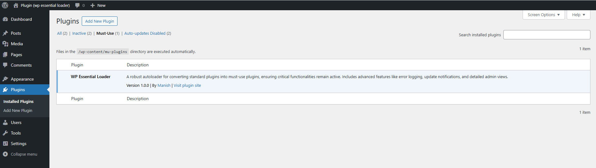
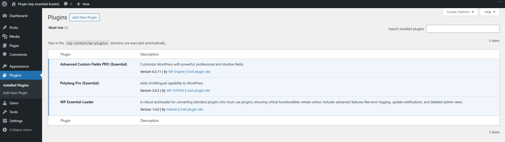

<h1>WP Essential Loader</h1>

<h2>Overview</h2>

MU plugins (Must-Use Plugins) are essential for ensuring that critical functionalities of your WordPress site remain intact. For instance, if plugins like <strong>ACF (Advanced Custom Fields)</strong> or <strong>ACF Pro</strong> are extensively used and accidentally deactivated, the entire website might break due to missing hooks and functions. Similarly, deactivating a multilingual plugin such as <strong>WPML</strong> or <strong>Polylang</strong> can lead to errors or a failure to load localized content.

To prevent such issues, it’s recommended to move essential plugins or their core components into the <code>mu-plugins</code> directory. This guarantees that they stay active and operational, maintaining the stability and performance of your site.

<h2>What Are MU Plugins?</h2>

MU plugins are a special type of WordPress plugin that is automatically activated and cannot be deactivated through the WordPress admin dashboard. These plugins are loaded by WordPress before any standard plugins, making them essential for certain functionalities.

<h3>Key Features of MU Plugins</h3>
<ul>
    <li><strong>Automatic Activation</strong>: Simply place them in the <code>mu-plugins</code> directory, and they will be activated. They cannot be turned off via the WordPress dashboard.</li>
    <li><strong>Custom Directory</strong>: MU plugins reside in the <code>wp-content/mu-plugins</code> directory.</li>
    <li><strong>No Admin Management</strong>: They do not appear in the standard plugins list but can be viewed in the "Must-Use" plugins section in the admin area.</li>
    <li><strong>No Update Notices</strong>: MU plugins do not show update notifications.</li>
</ul>

<h2>Use Cases for MU Plugins</h2>
<ul>
    <li><strong>Site-Wide Functionalities</strong>: Implement site-wide changes that need to be active at all times, such as custom login functionalities or essential security tweaks.</li>
    <li><strong>Multisite Networks</strong>: Manage functionalities across multiple sites within a WordPress multisite network.</li>
    <li><strong>Preventing Deactivation</strong>: Ensure that critical plugins or custom code cannot be accidentally deactivated by administrators.</li>
</ul>

<h2>How to Install an MU Plugin</h2>
<ol>
    <li><strong>Create the <code>mu-plugins</code> Directory</strong>: Ensure the directory <code>wp-content/mu-plugins</code> exists. Create it manually if it doesn’t.</li>
    <li><strong>Add Your Plugin</strong>: Place your PHP file or plugin code directly in this directory. Note that MU plugins should not be in subdirectories by default.</li>
    <li><strong>Use Multiple Files (Optional)</strong>: If you wish to include multiple files, reference them in a main file using <code>require_once</code> or <code>include_once</code>.</li>
</ol>

<h3>Example Screenshots</h3>

<strong>Before moving plugins to the <code>mu-plugins</code> directory</strong>

<strong>After moving plugins to the <code>mu-plugins</code> directory</strong>

<h2>Advantages of MU Plugins</h2>
<ul>
    <li><strong>Reliability</strong>: Always active, ensuring critical functionalities remain intact.</li>
    <li><strong>Security</strong>: Prevents accidental deactivation and tampering.</li>
    <li><strong>Performance</strong>: Loaded early in the WordPress loading process, which can enhance core functionality performance.</li>
</ul>

<h2>Disadvantages of MU Plugins</h2>
<ul>
    <li><strong>Limited Management</strong>: To make changes, you need direct access to the files.</li>
    <li><strong>No Automatic Updates</strong>: MU plugins require manual updates if needed.</li>
</ul>

<h2>Conclusion</h2>

MU plugins are especially beneficial for developers and administrators who need strong control over a WordPress site’s core functionalities. By placing critical code in the <code>mu-plugins</code> directory, you ensure that vital features remain active and protected from accidental deactivation.

